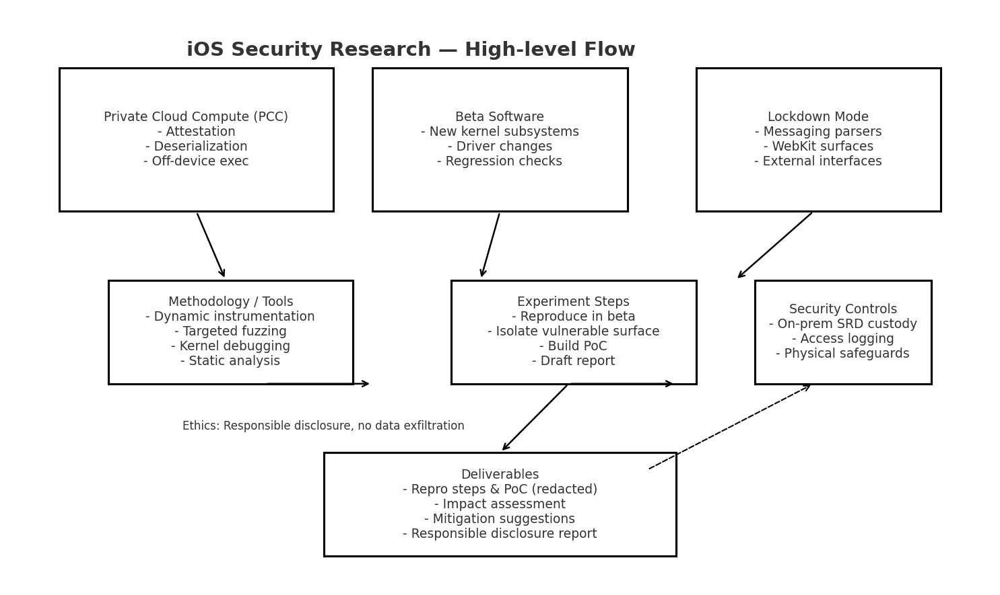

# iOS Security Research Notes

This repository contains structured notes and methodologies I use while studying iOS security.
The focus areas align with my ongoing research and with my Apple SRD application.

## 📌 Focus Areas
- **Private Cloud Compute (PCC)**  
  Exploring potential attack surfaces, integrity verification, and attestation flows.

- **Beta Software Regressions**  
  Tracking and testing new iOS beta builds for regressions, newly introduced bugs, or 
  reappearing vulnerability classes.

- **Lockdown Mode**  
  Evaluating bypass opportunities for the restrictions enforced by Lockdown Mode, such as 
  messaging parsers, WebKit hardening, and external interface handling.

## 📖 Notes
- `notes/pcc-attack-surfaces.md`
- `notes/lockdown-mode-testing.md`
- `notes/beta-regression-checklist.md`

---

*Figure: High-level flow of my iOS security research methodology.  
Each focus area (PCC, Beta regressions, Lockdown Mode) feeds into structured testing with fuzzing, instrumentation, and static analysis.  
All work follows strict **ethical guidelines** — research is performed responsibly, without data exfiltration, and findings are shared only through responsible disclosure channels.*

## Ethics & Experimental Trace (example)
- Example test artifact: `ios-fuzzing-harness/results.log` (contains anonymized harness output and exception classes observed).
- Tests are performed on local test harnesses and open-source parsers only. No Apple proprietary code or customer data is used.
- All findings will be responsibly disclosed to vendors and Apple as per program rules.

## ⚠️ Disclaimer
These notes are for **educational and research purposes only**.  
No active exploit code or confidential Apple intellectual property is included.
